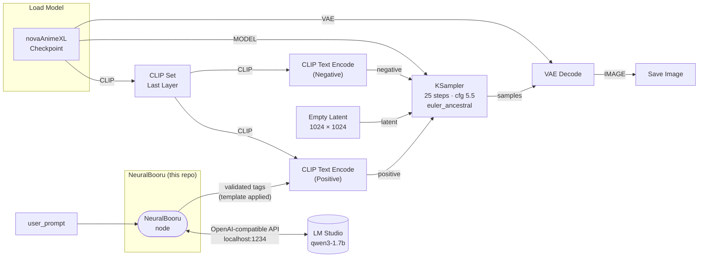

**Turn plain English into real Danbooru tags using a local LLM. No cloud, no API keys, no nonsense.**

NeuralBooru is a ComfyUI custom node that bridges your local LM Studio instance and your image generation pipeline. Describe a scene in plain English and it converts it into booru-style tags, validates them against the real Danbooru vocabulary so only tags your model was actually trained on survive, wraps them in your model's preferred template, and feeds them straight into the sampler.


---

## What makes it different

Most tag generators are specialized fine-tuned models (like TIPO/DanTagGen) that bake the tag vocabulary into their weights. NeuralBooru takes the opposite approach: it is a **model-agnostic adapter**. The LLM proposes, and a Danbooru whitelist disposes.

- **Bring your own LLM.** It uses whatever model you run in LM Studio. Swap a 1.7B for a 7B or next year's model and the output improves for free.
- **General world knowledge.** A general LLM understands "a noir detective in 1940s LA" or franchise references and reasons about what tags they imply.
- **Validated output.** Every tag is checked against ~140k real Danbooru tags, so "tag-shaped" natural language never leaks into your prompt.
- **Editable in plain English.** Change behavior by editing the system prompt, not by retraining a model.

---

## How It Works



A real run. You type:

```
A cute vampire girl with fangs, wearing jean shorts and a black crop top,
arms crossed and smirking, standing in a dark classroom at night
```

The LLM proposes messy, tag-ish phrases:

```
1girl, young adult, vampire, fangs, jean shorts, black crop top,
arms crossed, smirking, dark classroom, night, standing
```

Validation cleans them into real Danbooru tags:

```
1girl, vampire, fangs, denim shorts, crop top, crossed arms, smirk,
dark, classroom, night, standing
```

Note what happened: `jean shorts` was remapped to the real alias `denim shorts`, `arms crossed` to `crossed arms`, `smirking` to `smirk`, `crop top` and `classroom` were pulled out of multi-word phrases, and `young adult` (not a real tag) was dropped. Finally the tags are wrapped in your template and the non-tags are reported on the `dropped_tags` output.

And the result, straight from that prompt through NovaAnimeXL:

<p align="center">
  
</p>

Everything runs locally. No internet connection required after setup.

---

## Features

- **Real tag validation** - every tag is checked against the Danbooru vocabulary, with alias remapping, word-form fixing, and multi-word recovery
- **Model-agnostic** - uses LM Studio's OpenAI-compatible API with any chat model you have loaded
- **Qwen3 optimized** - includes the `/no_think` directive to skip reasoning tokens and get clean output fast
- **Template system** - inject generated tags into any model's preferred prompt format via the `{prompt}` placeholder
- **Transparency** - a second `dropped_tags` output shows exactly what was filtered
- **Graceful fallback** - if LM Studio is not running, it wraps your raw description instead of erroring
- **Zero dependencies** - pure Python stdlib, nothing to install

---

## Tag Validation

This is the core of NeuralBooru. After the LLM responds, every candidate tag is resolved against a bundled list of ~140k real Danbooru tags in this order:

1. **Exact match** - the tag exists as-is
2. **Alias remap** - `blonde` becomes `blonde hair`, `boobs` becomes `breasts`
3. **Word-form fix** - `smirking` becomes `smirk`, `posing` becomes `pose`
4. **Sub-phrase recovery** - real tags are pulled out of multi-word junk (`black crop top` yields `crop top`)
5. **Fuzzy match** - optional, off by default, remaps near-misses like typos
6. **Drop** - if nothing matches, the candidate is filtered out (strict mode) and reported

Your template (the quality boosters like `masterpiece, best quality`) is never validated. Only the LLM's tags are.

---

## Requirements

- [ComfyUI](https://github.com/comfyanonymous/ComfyUI)
- [LM Studio](https://lmstudio.ai) running locally with a model loaded
- A chat model that understands booru tagging. **Qwen3-1.7B** works great and is fast
- Any SDXL-compatible checkpoint (built and tested with [NovaAnimeXL](https://civitai.com/models/376130/nova-anime-xl))

---

## Installation

**Via ComfyUI Manager** (recommended):
Search for `NeuralBooru` in the Custom Nodes section.

**Manual:**
```bash
cd ComfyUI/custom_nodes
git clone https://github.com/ChrisJohnson89/ComfyUI-NeuralBooru
```

Restart ComfyUI. The **NeuralBooru** node will appear under the `NeuralBooru` category.

---

## Quick Start

1. Start LM Studio and load a model (Qwen3-1.7B recommended)
2. Enable the local server in LM Studio (default port 1234)
3. Open ComfyUI and load the included workflow: `workflows/AI_Anime.json`
4. Type your scene description in the `user_prompt` field
5. Hit Run

Tag validation is on by default. Check the ComfyUI console for a `[NeuralBooru] dropped N non-tags` line to see what got filtered.

---

## Node Parameters

| Parameter | Default | Description |
|---|---|---|
| `user_prompt` | - | Plain English scene description |
| `system_prompt` | Built-in | Instructions for the LLM, controls tag style and rules |
| `prompt_template` | NovaAnimeXL | Wrapper for generated tags. Use `{prompt}` as placeholder |
| `model` | `qwen/qwen3-1.7b` | Model identifier as shown in LM Studio |
| `temperature` | `0.4` | Lower = more consistent tags, higher = more creative |
| `max_tokens` | `500` | Max tokens for the LLM response |
| `lm_studio_url` | `http://localhost:1234` | LM Studio server address |
| `validate_tags` | `True` | Filter the LLM output against the Danbooru vocabulary |
| `strict_tags` | `True` | Drop tags that are not real (off = keep them) |
| `fuzzy_cutoff` | `0.0` | 0 disables. 0.85-0.95 remaps near-misses to real tags |
| `min_post_count` | `0` | Drop tags rarer than this many Danbooru posts |
| `max_tags` | `0` | 0 = unlimited, otherwise cap the tag count |

### Outputs

| Output | Description |
|---|---|
| `prompt` | The validated, template-wrapped prompt for your CLIP encoder |
| `dropped_tags` | Comma-separated list of candidates that were filtered out |

### Prompt Template

The template wraps the generated tags. The `{prompt}` token is replaced with the validated tags:

```
masterpiece, best quality, ..., {prompt}, BREAK, depth of field, volumetric lighting
```

Swap this out for any model's preferred format.

---

## Recommended Setup

| Setting | Value | Why |
|---|---|---|
| Model | Qwen3-1.7B | Fast, great tag quality, supports `/no_think` |
| Temperature | 0.4 | Consistent, accurate booru tags |
| Max tokens | 500 | Enough for detailed scenes, won't waste time |
| Checkpoint | NovaAnimeXL Illustrious | What the default template is tuned for |
| validate_tags | On | Keeps only real Danbooru tags |

---

## Credits

Tag data is derived from the Danbooru tag list distributed with
[DominikDoom/a1111-sd-webui-tagcomplete](https://github.com/DominikDoom/a1111-sd-webui-tagcomplete).

---

## License

MIT - do whatever you want with it.


