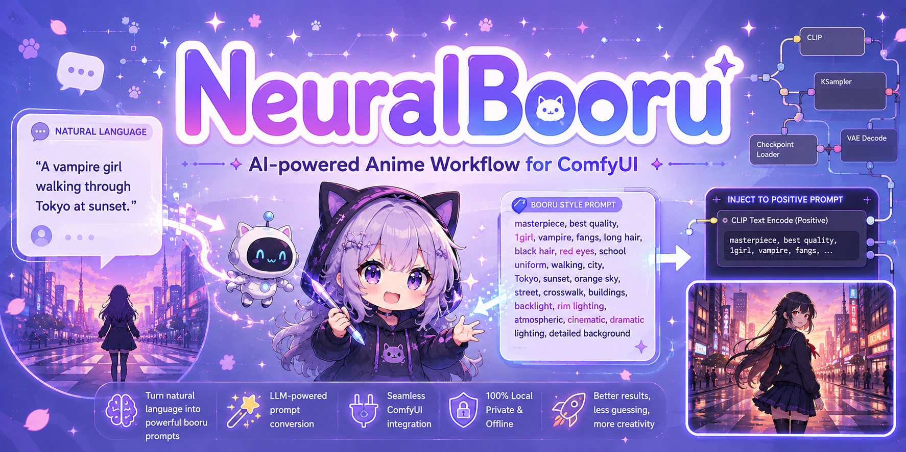
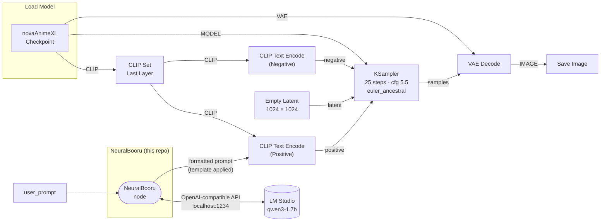

<p align="center">
  
</p>
**Turn plain English into Booru-style prompts using a local LLM — no cloud, no API keys, no nonsense.**

NeuralBooru is a ComfyUI custom node that bridges your local LM Studio instance and your image generation pipeline. Describe a scene in plain English and it automatically converts it into precise booru-style tags, wraps them in your model's preferred template, and feeds them straight into the sampler.

 

---

## How It Works



```
"vampire girl in a dark classroom at night"
        ↓  (local LLM via LM Studio)
"1girl, vampire, fangs, black hair, red eyes, classroom, night, moonlight, dark atmosphere"
        ↓  (NovaAnimeXL template)
"masterpiece, best quality, ..., 1girl, vampire, ..., BREAK, depth of field, volumetric lighting"
```

Everything runs locally. No internet connection required after setup.

---

## Features

- **100% local** - uses LM Studio's OpenAI-compatible API, your machine, your models
- **Qwen3 optimized** - includes `/no_think` directive to skip reasoning tokens and get clean output fast
- **Template system** - inject generated tags into any model's preferred prompt format via `{prompt}` placeholder
- **Graceful fallback** - if LM Studio isn't running, falls back to wrapping your raw description directly
- **Zero dependencies** - pure Python stdlib, nothing to install

---

## Requirements

- [ComfyUI](https://github.com/comfyanonymous/ComfyUI)
- [LM Studio](https://lmstudio.ai) running locally with a model loaded
- A chat model that understands booru tagging — **Qwen3-1.7B** works great and is fast
- Any SDXL-compatible checkpoint (built and tested with [NovaAnimeXL](https://civitai.com/models/376130/nova-anime-xl))

---

## Installation

**Via ComfyUI Manager** (recommended):
Search for `NeuralBooru` in the Custom Nodes section.

**Manual:**
```bash
cd ComfyUI/custom_nodes
git clone https://github.com/ChrisJohnson89/ComfyUI-NeuralBooru
```

Restart ComfyUI. The **NeuralBooru** node will appear under the `NeuralBooru` category.

---

## Quick Start

1. Start LM Studio and load a model (Qwen3-1.7B recommended)
2. Enable the local server in LM Studio (default port 1234)
3. Open ComfyUI and load the included workflow: `workflows/AI_Anime.json`
4. Type your scene description in the `user_prompt` field
5. Hit Run

---

## Node Parameters

| Parameter | Default | Description |
|---|---|---|
| `user_prompt` | - | Plain English scene description |
| `system_prompt` | Built-in | Instructions for the LLM — controls tag style and rules |
| `prompt_template` | NovaAnimeXL | Wrapper for generated tags. Use `{prompt}` as placeholder |
| `model` | `qwen/qwen3-1.7b` | Model identifier as shown in LM Studio |
| `temperature` | `0.4` | Lower = more consistent tags, higher = more creative |
| `max_tokens` | `500` | Max tokens for the LLM response |
| `lm_studio_url` | `http://localhost:1234` | LM Studio server address |

### Prompt Template

The template wraps the generated tags. The `{prompt}` token is replaced with LLM output:

```
masterpiece, best quality, ..., {prompt}, BREAK, depth of field, volumetric lighting
```

Swap this out for any model's preferred format.

---

## Recommended Setup

| Setting | Value | Why |
|---|---|---|
| Model | Qwen3-1.7B | Fast, great tag quality, supports `/no_think` |
| Temperature | 0.4 | Consistent, accurate booru tags |
| Max tokens | 500 | Enough for detailed scenes, won't waste time |
| Checkpoint | NovaAnimeXL Illustrious | What the default template is tuned for |

---

## License

MIT - do whatever you want with it - I do not care.

